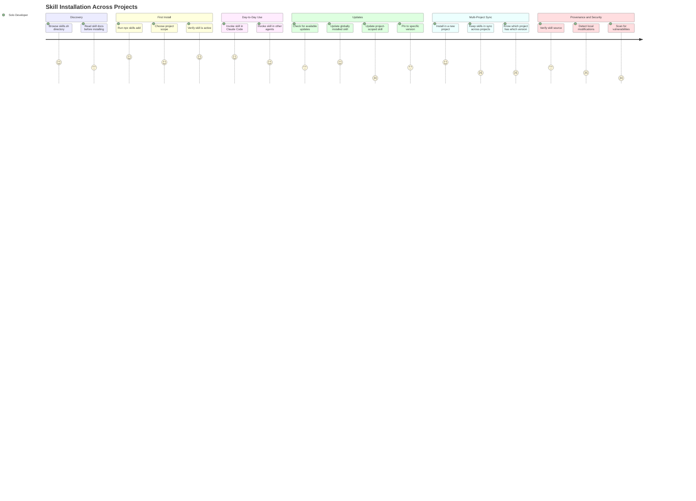

# JOURNEY-001 Skill Installation Across Projects

## Persona

**[PERSONA-001 Solo Framework Developer](../../persona/(PERSONA-001)-Solo-Framework-Developer/(PERSONA-001)-Solo-Framework-Developer.md)** — the Pragmatic Tinkerer. Maintains an agents-standalone framework with shared skills. Publishes skills from a monorepo (subtree-split to a `L3-agents` distribution branch). Consumes third-party skills into multiple personal projects. Uses Claude Code primarily, sometimes Gemini CLI or Cursor. Has Node.js available. Not building infrastructure — wants to ride ecosystem tooling and fill gaps.

## Goal

Install shared skills into projects, keep them current, and understand what's installed — using ecosystem tools (`npx skills`) rather than maintaining custom installation infrastructure.

## Steps / Stages

### Discovery

The developer hears about a skill or searches for one to solve a problem.

- **Browse skills.sh directory:** The skills.sh site surfaces skills by install count and category. Works for popular skills but long-tail discovery is limited — no semantic search, just name matching and keyword tags. Adequate for now.
- **Read skill docs before installing:** Most skills are a single SKILL.md with no README or usage examples on GitHub. You commit to installing before you can really evaluate — the full instructions only make sense in-context with an agent.

### First Install

The developer installs a skill into a project for the first time.

- **Run `npx skills add owner/repo@L3-agents`:** Clean one-liner. Branch specification via `@ref` works. The CLI discovers SKILL.md files in standard locations (`.agents/skills/`, `skills/`, `.claude/skills/`). Installs to the correct agent-specific directory. This is the happy path.
- **Choose project scope:** The interactive prompt asks project vs global. Project-scoped installation puts skills in `.claude/skills/` (for Claude Code) and creates a `skills-lock.json` at the project root. This is the right default for per-project skills.
- **Verify skill is active:** After install, the skill appears in Claude Code's skill list and can be invoked. No manual configuration needed.

### Day-to-Day Use

The developer uses installed skills in their agent workflow.

- **Invoke skill in Claude Code:** Skills auto-discovered on session start. Invocation is seamless — Claude matches the skill's description to the task context. No friction here.
- **Invoke skill in other agents:** `npx skills` installs to agent-specific directories. Gemini CLI, Cursor, Codex all pick up skills from their expected paths. Cross-agent portability works.

### Updates

The developer wants to pull the latest version of an installed skill.

- **Check for updates:** `npx skills check` works for globally installed skills. It posts skill hashes to the update API and compares against GitHub tree SHAs.
- **Update a globally installed skill:** `npx skills update` pulls latest. Works as expected.
- **Update a project-scoped skill:** **Broken.** `npx skills update` does not track project-scoped installations. [Issue #337](https://github.com/vercel-labs/skills/issues/337) is open but unresolved. The workaround is to re-run `npx skills add` (idempotent) — but you have to know to do this, and there's no notification that an update is available.

  > **Pain point:** This is the biggest gap. Per-project skills are the natural model for team repos and framework adopters, but the update story is missing. You're stuck manually re-adding skills or writing a wrapper script.

- **Pin to a specific version:** Lock file tracks the `ref` used at install time. You can install at a tag (`@v1.0.0`) and it stays pinned. But there's no `npx skills pin` command — you have to remember the ref syntax.

### Multi-Project Sync

The developer uses the same skills across multiple projects and wants them consistent.

- **Install in a new project:** Repeat `npx skills add` in each project. No friction on first install, but there's no "install from lockfile" command (like `npm install` from `package.json`). Each project is independently managed.

  > **Pain point:** No declarative skill manifest. You can't check in a "these are my project's skills" file and have a colleague (or a fresh clone) reproduce the setup with one command. The `skills-lock.json` exists but there's no `npx skills install` that reads it.

- **Keep skills in sync:** No cross-project view. You update one project and forget the others. Drift is silent.

  > **Pain point:** Skills drift across projects with no notification. A simple `npx skills sync` or even a lockfile-based install would solve this, but neither exists today.

### Provenance & Security

The developer wants to understand what's installed, where it came from, and whether it's safe.

- **Verify skill source:** `skills-lock.json` records `source` (owner/repo) and `ref`. Adequate for basic "where did this come from" questions.
- **Detect local modifications:** The lock file stores a `skillFolderHash` (GitHub tree SHA). In principle you could compare, but there's no CLI command to check drift on project-scoped skills.

  > **Pain point:** No `npx skills audit` or drift-check command. The data is in the lock file but there's no user-facing workflow to surface it.

- **Scan for vulnerabilities:** No ecosystem tooling exists. Community audits have found ~13% of published skills contain issues, but there's no automated scanner.

  > **Pain point:** Skills are executable prompts that can invoke tools, write files, and run commands. The ecosystem has no security scanning. This is an industry-wide gap, not specific to `npx skills`, but it matters.

## Pain Points Summary

| Pain Point | Score | Stage | Root Cause | Opportunity |
|---|---|---|---|---|
| Project-scoped skill updates broken | 1 | Updates | `npx skills update` only tracks global installs ([#337](https://github.com/vercel-labs/skills/issues/337)) | Track upstream issue; workaround: re-run `npx skills add` |
| No vulnerability scanning | 1 | Provenance | Industry-wide gap — no skill-level security tooling exists | Monitor ecosystem; `.source.yml` provenance could feed future scanners |
| No declarative skill manifest / lockfile install | 2 | Multi-Project | `skills-lock.json` exists but can't be used as input | Could contribute upstream or build thin wrapper: `npx skills install --from-lock` |
| Skills drift across projects silently | 2 | Multi-Project | No cross-project awareness | Script or Makefile pattern: loop over projects, run `npx skills add` |
| No drift detection CLI | 2 | Provenance | Hash data in lock file but no user command | Could layer `.source.yml` stamping as post-install hook; or contribute `npx skills check --project` |

## Opportunities

1. **Ride the ecosystem, fill the gaps.** `npx skills` handles discovery, install, and cross-agent routing well. The pain concentrates in lifecycle management (updates, sync, provenance) — not core installation. Don't rebuild what works; patch what doesn't.

2. **Thin gap-fillers, not competing tools.** The gaps can be addressed with lightweight scripts (a `Makefile` target, a post-install hook, a `.source.yml` stamper) rather than a full skill manager. Keep `remote-skill-manager`'s provenance stamping as a standalone script; deprecate its fetch/install function.

3. **Track upstream.** Issue #337 (project-scoped updates) is the single highest-impact fix. If Vercel ships it, two of the five pain points disappear. Contribute or watch.

4. **Prepare for scanning.** `.source.yml` provenance manifests position this framework well for future security scanning tools. Stamp provenance post-install so the data is ready when scanners arrive.

## Lifecycle

| Phase | Date | Commit | Notes |
|-------|------|--------|-------|
| Draft | 2026-03-01 | 5a4251f | Initial creation from SPIKE-002 investigation |
