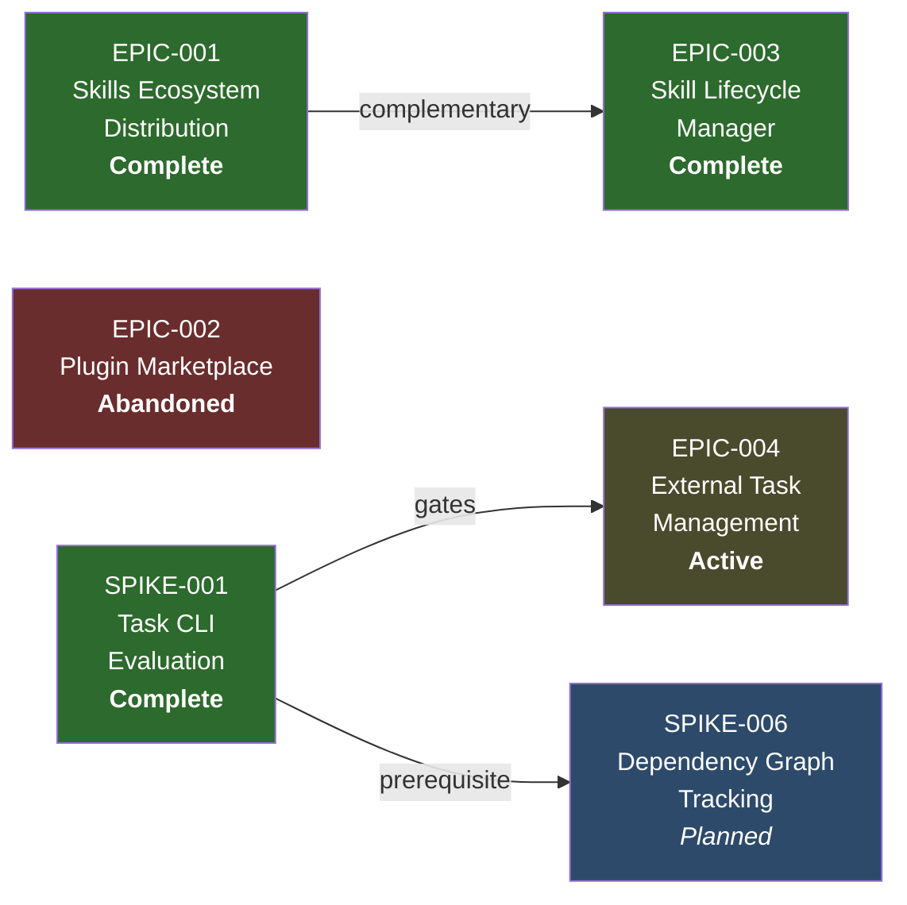

# Roadmap

Supporting document for [VISION-001 Agents Standalone Framework](./\(VISION-001\)-Agents-Standalone-Framework.md).

## Epic Sequence

## Status Table

| Epic | Goal | Phase | Dependencies | Notes |
|------|------|-------|--------------|-------|
| EPIC-001 | Ride the Agent Skills ecosystem for zero-effort skill distribution | **Complete** | ADR-001, SPIKE-003 | 3/3 stories done |
| EPIC-002 | Claude Code plugin marketplace | **Abandoned** | SPIKE-003 (gate) | Rejected for vendor lock-in |
| EPIC-003 | Full-lifecycle skill management (discovery through drift detection) | **Complete** | SPIKE-002, SPIKE-005, ADR-003 | 5/5 stories done; 38/38 smoke tests |
| EPIC-004 | External CLI-based task store for cross-backend execution tracking | **Active** | SPIKE-001 (Complete) | bd (Beads) selected; child stories needed |

## Open Research

| Spike | Question | Blocks |
|-------|----------|--------|
| SPIKE-006 | How to track spec dependency graphs in an LLM-friendly way? | Future epic TBD |

## What's Next

1. **Create child stories for EPIC-004** — define the work to formalize bd integration, observer patterns, and fallback behavior in execution-tracking
2. **Execute SPIKE-006** — investigate dependency graph approaches (SPIKE-001 prerequisite now satisfied)
